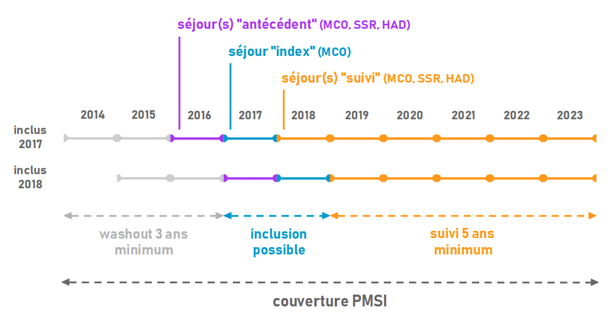
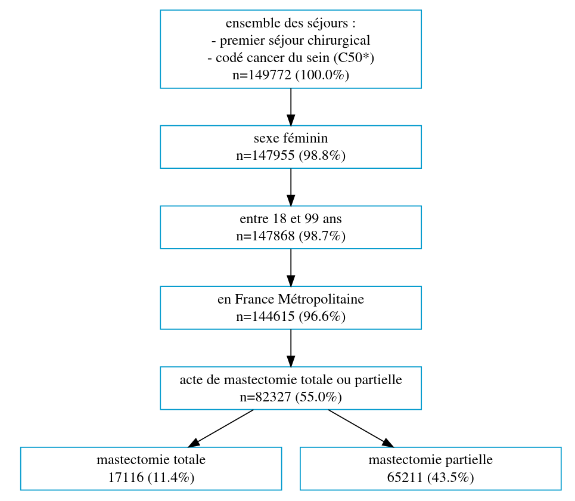
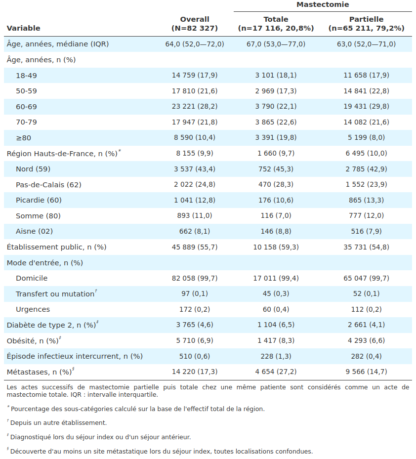
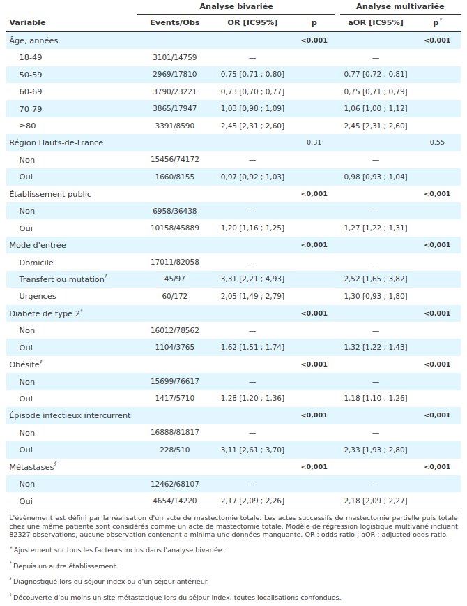

```{r}
#| label: setup
#| include: false
library(knitr)
```

::: callout-note
# Le Complément (analyse statistique et scripts R) est [**consultable en ligne**](https://html-preview.github.io/?url=https://codeberg.org/hebstr/m2/raw/branch/main/memoire/annexe.html).
:::

# INTRODUCTION

La région Hauts-de-France (HdF) compte 5 983 823 habitants @estimation. C'est la région la plus pauvre de France métropolitaine, avec près de 20% de la population vivant sous le seuil de pauvreté @comparateur.
L'espérance de vie à la naissance en 2023 est inférieure au reste de la France métropolitaine, tant chez les hommes (78,1 ans versus 80,1 ans) que chez les femmes (84,2 versus 85,8 ans) @esperance.
Par ailleurs, la densité de médecins spécialistes, libéraux ou salariés dans les HdF est inférieure à la densité nationale (145/100 000 habitants contre 171) @quelle.
Bien qu'elle se distingue par des indicateurs moins favorables que dans le reste de la France métropolitaine, la région présente aussi des disparités très marqués entre ses cinq départements constitutifs (le Nord, le Pas-de-Calais, la Somme, l'Aisne et l'Oise). Dans les HdF, la couverture par les registres des cancers est limitée à la Somme et à la Métropole Européenne de Lille.

Le cancer du sein est le cancer le plus fréquent chez la femme, avec une incidence annuelle estimée à 61 214 cas en 2023, en France métropolitaine. Il s'agit également de la première cause de décès par cancer dans cette population (12 100 décès estimés par an en 2023) @beh.

Sur la période 2007-2016, l'incidence du cancer du sein dans les HdF est estimée à 5 032 nouveaux cas par an @incidence. Le taux d'incidence standardisé sur la population mondiale (TSM) est estimé à 103,8/100 000 personnes-années, ce qui place les HdF en 2ème position des régions métropolitaines derrière l'Île-de-France.
Cette surincidence est de l'ordre de +6%. Ceci masque une forte disparité intrarégionale, puisqu'il n'existe de surincidence que pour le Nord (+8%), celle des autres départements étant comparable au reste de la Métropole.

Sur la période 2007-2014, le nombre de décès par cancer du sein est estimé à 1268 cas par an @incidence. Le TSM est estimé à 19,6 pour 100 000 personnes-années, ce qui place les HdF au premier rang des régions métropolitaines.
La surmortalité observée dans la région HdF est de l'ordre de +25%, avec une forte disparité spatiale allant de +13% dans l'Oise à +33% dans le Pas-de-Calais. Les indicateurs de mortalité sont globalement très défavorables et marqués là encore par une forte disparité intrarégionale.

Sur la période 2021-2022, le taux de participation au dépistage organisé dans les HdF est de 47,7%, comparable au taux de participation national @taux.
Alors que le taux 2022-2023 est stable ou en baisse par rapport à la période précédente dans la plupart des régions de France métropolitaine, une hausse est observée dans les HdF avec une participation de 48,5%.
Il persiste cependant des disparités intrarégionales, avec notamment une participation plus élevée dans la Somme (52,7%) que dans l'Oise (46,2%). Les indicateurs de participation au dépistage sont plutôt favorables, mais suggèrent une nette disparité spatiale.

La mortalité due au cancer du sein est liée à la rechute métastatique, qui, survenant chez 20 à 25% des patientes, reste incurable en 2024. À un stade localisé, les cancers du sein peuvent être séparés en 3 entités biomoléculaires distinctes, avec une agressivité et un risque de rechute métastatique et de mortalité croissants : les cancers exprimant les récepteurs hormonaux (oestrogène et progestérone) mais pas le récepteur HER2, dits RH+/HER2- (60%) ; les cancers exprimant le récepteur HER2, dits HER2+ (15%) ; les cancers n'exprimant aucun récepteur, dits triple négatifs ou RH-/HER2- (15%). Par ailleurs, environ 5% des cancers du sein sont liés à une prédisposition génétique, notamment via les altérations germinales des gènes BRCA1/BRCA2.

Ces facteurs sont à prendre en compte dans les modèles d'étude. Cependant, la répartition des trois formes de cancers du sein dans les HdF n'est pas connue précisément ; afin de mettre en évidence d'éventuelles disparités entre les départements des HdF et avec le reste de la France métropolitaine, il est nécessaire d'acquérir davantage de données.

Les données massivement collectées à l'échelle nationale et stockées dans des bases de données médico-administratives peuvent être réutilisées à des fins de recherche médicale @reuse. La base nationale du PMSI (programme de médicalisation des systèmes d'information) collige nationalement tous les séjours d'hospitalisation réalisés par les établissements (publics, privés non-lucratifs, et privés lucratifs) à l'Assurance Maladie, soit environ 30 millions de séjours par an. Le SNDS (système national des données de santé) est une base nationale constituée des données du PMSI auxquelles s'ajoutent les soins ambulatoires (e.g., consultations, délivrances de médicaments en pharmacie, soins infirmiers) et la description fine des motifs de décès (CépiDC) @snds.

L'objectif de cette étude était de caractériser et comparer les cancers du sein dans les HdF en termes de nature, de prise en charge et de survie avec le reste de la France métropolitaine, à l'aide d'une analyse de données massives France entière (PMSI/SNDS).

L'objectif principal de cette étude était d'évaluer la survie globale chez les patientes atteintes d'un cancer du sein dans les Hauts-de-France comparativement au reste de la France métropolitaine. La réutilisation de données massives France entière issues des bases nationales du PMSI et du SNDS permettaient de caractériser et comparer les cancers du sein en termes de nature et de prise en charge.

# MÉTHODES

## Sources de données

Il s'agit d'une étude de cohorte rétrospective en population basée sur la réutilisation de données provenant des bases nationales du PMSI et du SNDS, qui contiennent les dossiers patients informatisés relatifs à tous les séjours réalisés dans un établissement français public ou privé.
Un séjour est identifié par un numéro unique conservé quelle que soit la date, l'établissement ou le champ d'hospitalisation (médecine chirurgie obstétrique (MCO), soins médicaux de réadaptation (SMR), hospitalisation à domicile (HAD), psychiatrie et soins externes).
Pour chaque séjour, les diagnostics principaux et associés sont codés en classification internationale des maladies (CIM-10) @cim, les actes diagnostiques et thérapeutiques sont codés en classification commune des actes médicaux (CCAM) @ccam, et certains médicaments sont codés en unités communes de dispensation en dénomination commune internationale (UCD-DCI) @ucd. Le codage des établissements est intéressé, car il impacte directement leur financement.

Les données décrites permettent d'inférer des variables d'intérêt : si certaines variables sont nativement présentes (e.g., établissement, âge, décès, code postal du domicile, dates de soin), d'autres peuvent être déduites des codes présents. Les codes diagnostiques renseignent sur un cancer du sein en précisant sa localisation ; les traitements administrés permettent d'inférer le protocole de chimiothérapie et donc le profil génétique de la tumeur ; les actes thérapeutiques renseignent sur la prise en charge chirurgicale, les séances de radiothérapie et de chimiothérapie ; la combinaison des diagnostics et des actes thérapeutiques donne des éclairages très utiles sur les complications, carcinologiques ou non.
Il est ainsi possible de mener des analyses descriptives et pronostiques très poussées, et de comparer sur chacun de ces points la région HdF aux autres régions.

## Population

Toutes les femmes âgées de 18 à 99 ans, résidant en France métropolitaine, et affiliées à un régime d'Assurance Maladie étaient incluses à compter de la date d'un premier séjour hospitalier en MCO (séjour index) associé à un diagnostic tout confondu de cancer du sein (racine C50 dans la CIM-10). Un séjour index est considéré comme tel si aucun autre séjour associé à un diagnostic ou un acte en lien avec un cancer du sein n'est observée durant les trois années précédentes (période de washout de 3 ans). À chaque patiente est associé un seul séjour index. Les patientes ayant déclaré leur opposition à l'utilisation de données à des fins de recherche ont été exclues.

Cette cohorte historique sera suivie jusqu'au 31 décembre 2023, pendant une durée minimale de 5 ans à compter de la date du séjour index. Le PMSI peut couvrir une période de 10 ans, soit à partir du 1<sup>er</sup> janvier 2014 : en respectant une période de washout de 3 ans, seules les patientes ayant réalisé un séjour index entre le 1<sup>er</sup> janvier 2017 et le 31 décembre 2018 seront incluses. Afin d'analyser les antécédents, les séjours ayant une antériorité de 1 an à compter du séjour index seront récupérés. Il peut y avoir pour chaque patiente plusieurs séjours "suivi" ou "antécédent", enregistrés en MCO, SSR ou HAD. Le schéma d'inclusion est résumé par la @fig-inclusion.

```{r #fig-inclusion}
#| out-width: 8in
#| fig-align: center
#| fig-cap: Schéma d'inclusion à partir de la base nationale PMSI.


```

## Extraction de caractéristiques

Pour chaque patiente, les caractéristiques à l'inclusion telles que l'âge, la temporalité, la localisation géographique, les comorbidités (e.g., diabète, obésité, expositions documentées), et les complications immédiates seront décrites.
Le suivi des patientes permettra d'observer les étapes de la prise en charge, par le biais des dispensation des lignes de traitement ; les périodes de rémission, définies comme étant les périodes sans hospitalisation liée au cancer du sein ; les rechutes et leur prise en charge, ou le décès toutes causes ou spécifique du cancer du sein le cas échéant.

Les patientes seront classées métastatiques d'emblée si la première hospitalisation pour cancer du sein est décrite comme métastatique, en l'absence d'hospitalisation antérieure pour cancer du sein, et si la prise en charge initiale comporte une chimiothérapie sans mastectomie dans les 6 premiers mois. Les traitements mis en oeuvre pour ces patientes seront décrits (e.g., radiothérapie, séances de chimiothérapie en hôpital de jour, séances d'administration de trastuzumab, recours aux soins palliatifs).

Les cancers du sein localisés, quelle que soit l'exposition au trastuzumab, seront repérés par le code CIM-10 et l'acte de mastectomie. Les patients non-métastatiques et non exposées au trastuzumab seront considérées porteuses d'un cancer du sein de type HER2-. À l'inverse, les patientes non-métastatiques et exposées au trastuzumab en hôpital de jour en péri-opératoire seront considérées porteuses d'un cancer du sein de type HER2+. Pour ces patientes seront décrits : l'âge, les comorbidités, la nature de la chirurgie mammaire (partielle ou totale), le recours à la chirurgie de reconstruction, à la radiothérapie, à la chimiothérapie adjuvante ou néoadjuvante.

Les cancers du sein BRCA-mutés et les cancers du sein triple négatifs sont plus difficiles à repérer via le PMSI. Depuis mai 2022, les triple négatifs localisés peuvent être traités par pembrolizumab ; ce sont aussi des cancers du sein sans trastuzumab. Les cancers du sein BRCA-mutés peuvent être repérés en théorie par la prise orale d'olaparib via le SNDS. Ce sont des populations avec ALD non exonérante (avant le diagnostic de cancer). Il est prévu d'explorer ces pistes au cours de l'étude.

Le parcours de santé des patients sera retracé afin d'étudier la régularité du suivi avant diagnostic de cancer du sein (e.g., consultations de médecine générale, consultations de gynécologie médicale, mammographies). Cette analyse pourra servir à l'identification de potentiels facteurs associées à la survenue du cancer, ainsi qu'à l'évaluation des pratiques de dépistage et du délai avant diagnostic (e.g., pose de stérilet ou absence de contraception, entraînant un suivi moins régulier et un diagnostic plus tardif).

L'évènement principal sera le décès toute cause. Le critère de jugement principal sera la survie globale, définie comme l'intervalle entre le diagnostic de cancer du sein et la date du décès toute cause.
Pour les patientes non décédés, les données seront censurées à la date de point (31 décembre 2023). Des analyses pronostiques seront réalisées afin d'identifier les facteurs associés à une complication ou rechute (locale ou métastatique) parmi toutes les covariables à disposition (e.g., localisation, âge, comorbidités).

## Analyse de données

Des analyses bivariées seront réalisées afin de décrire le décès toute cause en fonction de variables telles que l'âge, la localisation géographique, le type d'établissement, le mode d'entrée, les comorbidités, ou le statut métastatique.
Des analyses multivariées seront réalisées afin de prédire la survenue d'un décès toute cause en fonction des variables explicatives sus-cités et d'identifier les facteurs associés.
Toutes les analyses seront stratifiées par profil biomoléculaire du cancer du sein et réalisées de manière comparative : comparaison intrarégionale puis avec le reste de la France métropolitaine.

## Analyse statistique

Les variables catégorielles et binaires seront présentées en termes de fréquence avec pourcentage. Les variables continues seront présentées en termes de moyenne avec écart-type. L'indépendance entre deux variables catégorielles sera testée à l'aide d'un test du Chi2. L'indépendance entre une variable catégorielle et une variable continue sera testée à l'aide d'un test t de Student en présence d'une variable catégorielle à deux modalités, ou d'une analyse de variance en présence d'une variable catégorielle à plus de deux modalités. L'indépendance entre deux variables quantitatives sera testée à l'aide d'un test de nullité du coefficient de corrélation de Pearson. Les tests statistiques seront bilatéraux. La significativité statistique sera définie par une p-valeur inférieure ou égale au seuil de 5%. Les p-valeurs seront ajustées en cas de comparaisons multiples.

Les courbes de temps jusqu'à évènement seront réalisées suivant la méthode de Kaplan-Meier. L'indépendance entre le temps jusqu'à évènement et une variable catégorielle sera testée à l'aide d'un test du Log Rank. Les risques seront quantifiés avec des hazard ratio par la réalisation de modèles de Cox bivariés puis multivariés sous réserve d'une hypothèse de proportionnalité vérifiée. La prédiction d'une variable binaire sera réalisée à l'aide de modèles de régression logistique bivariés puis multivariés. Les variables quantitatives continues seront catégorisées en cas de relation non logit-linéaire avec la probabilité de l'évènement. Les performances seront estimées à l'aide du calcul de l'aire sous la courbe ROC (AUC). Toutes les estimations seront accompagnées d'un intervalle de confiance à 95%. Les données manquantes seront analysées en termes de nombre et de fréquence, de nature et de pattern.

Les analyses statistiques seront réalisées avec R version 4.2.2 Patched (2022-11-10 r83330) @rstats.

## Protocole adaptatif

Contrairement à une étude impliquant la personne physique, l'analyse par réutilisation de données autorise un ajustement du protocole en fonction des résultats découverts, ce qui ouvre la voie à des analyses encore plus pertinentes et plus poussées.
Une attention toute particulière sera apportée à la période correspondant au début de la pandémie à Covid-19, et des périodes d'exclusion pourront être définies a posteriori en fonction des données observées.

## Cadre réglementaire

La conduite de cette étude a été approuvée par la Commission nationale de l'informatique et des libertés (CNIL). Les données ont été collectées sans aucune interaction avec les patientes et étaient anonymisées conformément à la réglementation en vigueur (MR-004). L'obtention d'un consentement écrit n'est pas applicable à ce type d'étude.

# RÉSULTATS

::: callout-important
# Avertissement
*Bien que l'accès à l'ensemble des données du PMSI fut possible, celui-ci a nécessité un certain nombre de formalités, si bien que les analyses telles que présentées dans la partie Méthodes n'ont pu être réalisées en respectant les échéances fixées pour la production du mémoire. Dans le cadre du mémoire, l'objectif a été grandement simplifié afin de faire la démonstration de ce que ces données permettent.*

*Cet objectif était le suivant : décrire la population de femmes ayant effectué un premier séjour avec réalisation d'une chirurgie mammaire (mastectomie totale ou partielle), qui constitue la variable d'intérêt, puis identifier des facteurs associés à la réalisation d'une mastectomie totale à l'aide d'un modèle de régression logistique multivarié.*
:::

## Flowchart

Entre 2017 et 2018, 149 772 sujets ont présenté un premier séjour hospitalier associé à diagnostic de cancer du sein. Parmi ces sujets, 144 615 (96.6%) étaient des patientes âgées de 18 à 99 ans et résidant en France métropolitaine. Un acte de mastectomie a été réalisé chez 82 327 (55,0%) patientes, 17 116 (11,4%) étant des mastectomies totales et 65 211 (43,5%) des mastectomies partielles. Les actes successifs de mastectomie partielle puis totale, ayant pu concerner certaines patientes, ont été considérés comme un acte de mastectomie totale (Annexe 2.1). Ces résultats sont présentés dans la @fig-flowchart.

```{r #fig-flowchart}
#| out-width: 6in
#| fig-align: center
#| fig-cap: Flowchart.
#| cap-location: top


```

## Description des patientes à l'inclusion

Parmi 82 327 patientes ayant subi une mastectomie, 17 116 (20,8%) ont subi une mastectomie totale. Les patientes ayant subi une mastectomie totale semblaient être plus âgées que celles ayant subi une mastectomie partielle, avec un âge médian de 67 ans (IQR 53 à 77) versus 63 ans (IQR 52 à 71). La mastectomie totale semblait être plus souvent réalisée dans un établissement public en comparaison à un autre type d'établissement (59,3% versus 54,8%). La mastectomie totale semblait être plus souvent réalisée chez les patientes métastatiques (27,2% versus 14,7%). Les résultats sont présentés dans la @tbl-bv.

```{r #tbl-bv}
#| out-width: 8in
#| fig-align: center
#| tbl-cap: Caractéristiques des patientes at baseline.


```

## Facteurs associés à la réalisation d'une mastectomie totale

L'évènement était défini comme étant la réalisation d'une mastectomie totale.
En raison d'une absence de logit-linéarité entre l'âge et la probabilité de l'évènement, la variable âge a été catégorisée (Annexe 2.2.1). Les observations correspondaient à des patientes distinctes et leur indépendance était supposée. L'absence de multicollinéarité était vérifiée pour toutes les covariables (Annexe 3.1.1). Les observations influentes détectées par la méthode des distances de Cook ont été conservées (Annexe 3.1.2).

Dans l'analyse bivariée, hormis la localisation géographique, l'ensemble des covariables étaient significativement associées à une augmentation du risque de subir une mastectomie totale plutôt qu'une mastectomie partielle (p<0.001). Dans l'analyse multivariée, cette majoration du risque persistait après ajustement sur toutes les covariables présentes dans l'analyse bivariée. Le modèle multivariée incluait la totalité des observations (aucune observation avec données manquantes). Les résultats sont présentés dans la @tbl-glm.

Une validation croisée à 10 plis a été réalisée afin d'estimer les performances du modèle. Celles-ci étaient jugées acceptables au regard d'une AUC moyenne à 63.7% calculée sur la base des estimations faites dans chaque pli (Annexe 4.2).

```{r #tbl-glm}
#| out-width: 8in
#| fig-align: center
#| tbl-cap: Modèles bivarié et multivarié de régression logistique expliquant la réalisation d'un acte de mastectomie totale vs mastectomie partielle.


```

# DISCUSSION

Initialement, cette étude visait à fournir une compréhension approfondie des facteurs contribuant à la surmortalité du cancer du sein dans les HdF comparativement au reste de la France métropolitaine, notamment à travers une caractérisation précise de la nature biomoléculaire de ce cancer jusqu'à présent mal connue dans cette région. L'objectif de cette étude a été simplifié pour finalement identifier les facteurs associés à la réalisation d'un acte de mastectomie totale versus mastectomie partielle, chez les patientes ayant effectué un premier séjour chirurgical en lien avec un diagnostic de cancer du sein.

L'âge élevé, la prise en charge dans un établissement public, la présence de comorbidités (diabète de type 2 et obésité), ainsi que la découverte de métastases semblent être des facteurs prédictifs de la réalisation d'une mastectomie totale au profit d'une mastectomie partielle.

Une arrivée depuis les urgences ou un transfert/mutation depuis un autre établissement étant significativement associées à une augmentation du risque de subir une mastectomie totale, en comparaison à une arrivée depuis le domicile, de même que la survenue d'un épisode infectieux durant le séjour. Ces situations correspondent à des profils de patientes plus gravement atteintes, toutefois en raison d'une répartition particulièrement disproportionnée des effectifs en ce qui concerne ces variables, il est probable que les coefficients furent surestimés.

L'étude des interactions entre les covariables, absente de notre analyse et pourtant essentielle, pourrait être réalisée à l'aide d'un arbre de décision binaire.

# RÉFÉRENCES

::: {#refs}
:::

# ANNEXES {.unnumbered}

Le Complément (analyse statistique et scripts R) est [consultable en ligne](https://html-preview.github.io/?url=https://codeberg.org/hebstr/m2/raw/branch/main/memoire/annexe.html).
